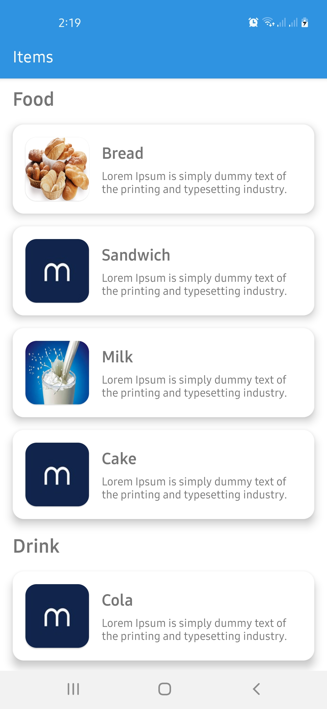
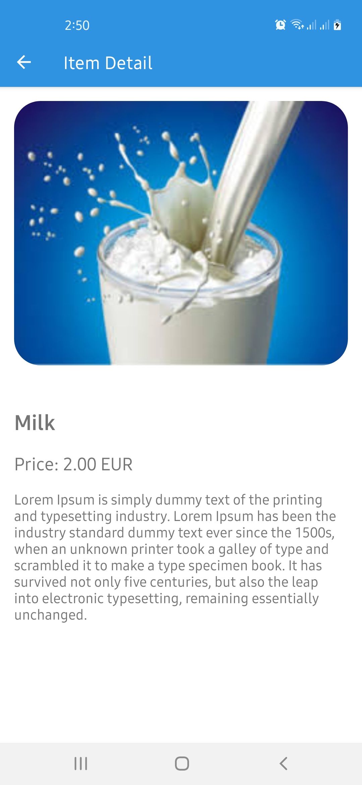
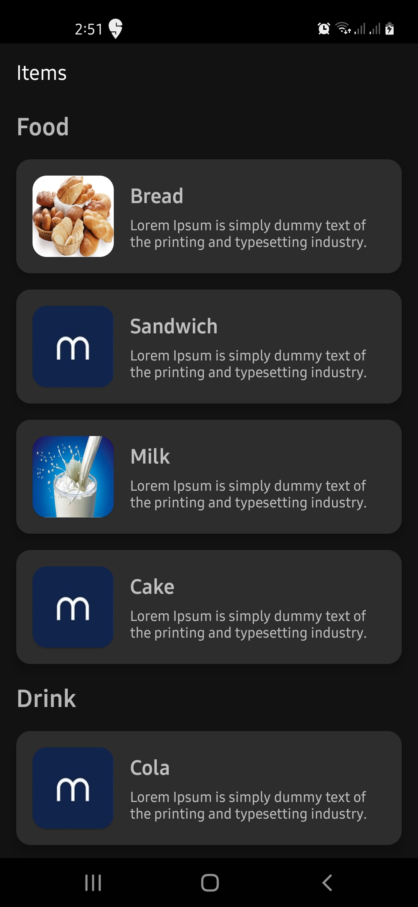
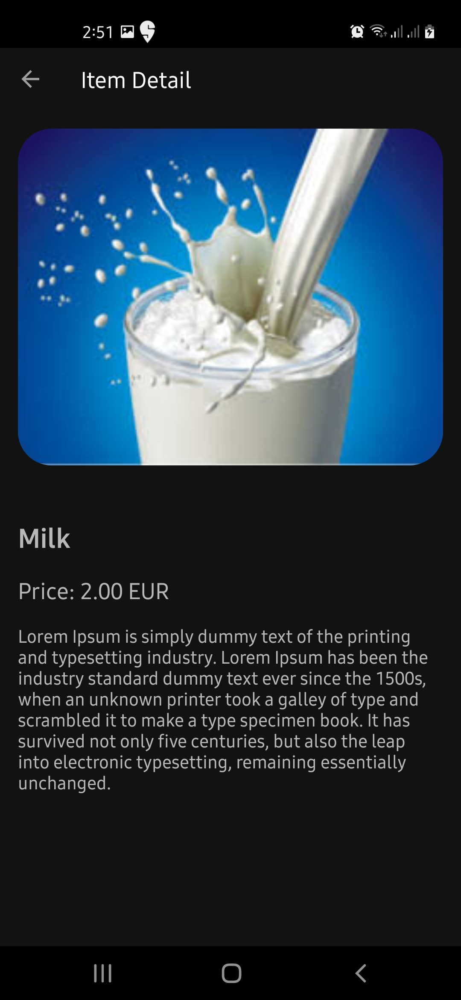

# List and Detail App
This is a clean architecture app example built with

- Coroutines
- MVVM
- Extension Functions
- Dagger Hilt
- Retrofit
- Navigation Components
- Cache Strategy (Repository Pattern)
- Coroutines Flow
- ViewBinding
- DataBinding
- Test Cases

## Library reference resources:

- Hilt: https://developer.android.com/training/dependency-injection/hilt-android

- MVVM Architecture : https://developer.android.com/jetpack/guide

- Coroutines: https://developer.android.com/kotlin/coroutines

- Data Binding: https://developer.android.com/topic/libraries/data-binding

- View Binding: https://developer.android.com/topic/libraries/view-binding

- Retrofit: https://square.github.io/retrofit/

- Repository Codelab: https://developer.android.com/codelabs/kotlin-android-training-repository

- Hilt Codelab: https://developer.android.com/codelabs/android-hilt

- Hilt Test cases : https://developer.android.com/training/dependency-injection/hilt-testing

## How to build on your environment
You can open the project in Android studio and press run.

# Screenshots
<table>
  <tr>
    <td>List And Detail Light</td>
  </tr>
  <tr>
    <td></td>
    <td></td>
  </tr>
  
   <tr>
    <td>List And Detail Dark</td>
  </tr>
  <tr>
    <td></td>
    <td></td>
  </tr>
 </table>

Notice: 1 I have added dummy description to make UI look good.
        2 Before running command make sure that your device is up and running.
